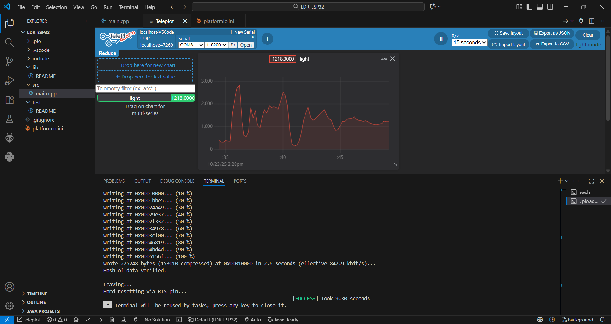

# ESP32 LDR Sensor Project 🌞

Dự án này kiểm tra hoạt động của **quang trở (LDR)** nối với **ESP32** qua chân ADC.  
Giá trị độ sáng (0–4095) được đọc liên tục và gửi qua UART ở baudrate `115200`,  
sau đó hiển thị bằng công cụ **Teleplot** trong Visual Studio Code.

## ⚙️ Cấu hình phần cứng
- LDR nối với **GPIO39/SVN**
- Điện trở 1kΩ mắc nối tiếp để tạo mạch chia áp
- Nguồn cung: 3.3V

## 📈 Đồ thị ánh sáng theo thời gian thực
Dưới đây là ảnh chụp từ **Teleplot** hiển thị giá trị ánh sáng đọc được:

## 📜 Mô tả hoạt động
ESP32 đọc giá trị analog từ LDR mỗi 200 ms, in ra UART dưới dạng:
